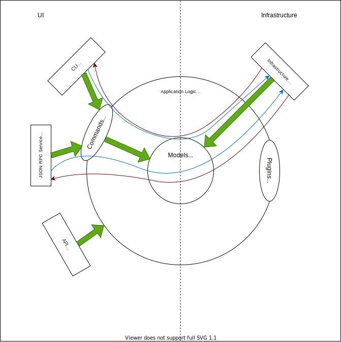

Developing
==========

.. _developing-reference:

Architecture Overview
---------------------

The high-level architecture of ``renku`` follows a Hexagonal/Ports&Adapters
Architecture approach.

The following diagram shows a rough outline of the architecture:

The bold, green arrows show the direction of dependencies (always inwards, e.g.
``renku.ui.cli`` can depend on ``renku.command`` but not the other way around). The
blue/red arrows denote the flow of control/information into and out of the
system.

The major components are:

* :code:`renku.ui.cli`: The command line interface code using the ``click`` library.
* :code:`renku.ui.rpc`: The JSON RPC server code used by the Renku platform.
* :code:`renku.ui.api`: The user API allowing easy access to renku features
  from users' Python scripts.
* :code:`renku.command`: Wrappers following a Command Builder pattern (see
  below) that is used to set up relevant context and post-execution code
  for calls into ``renku.core``.
* :code:`renku.infrastructure`: Contains implementations of interfaces for
  interfacing with the outside world, such as the internal database and git.
* :code:`renku.core`: The namespace for all business logic. Contains subfolders
  for different topics, such as ``dataset``, ``workflow`` and so on.
* :code:`renku.domain_model`: The domain models used within renku.
* :code:`renku.data`: Contains non-code data files used by renku.

Command Builder
---------------

Most of our business logic needs some context to be executed in, namely a Git
repository/Renku project, the local database containing our metadata and other
things such as requiring the repo to be clean, committing modified files after
successful execution, checking that the project is up to date and so on.

As this functionality is shared by many commands, we use a command builder to
wrap business logic commands, allowing the context to be set up easily.

The basic pattern is something like:

.. code-block:: python

   Command().command(_my_command).with_database(write=True).build().execute(arg1="a", arg2="")

The above would wrap the function ``_my_command`` in a command builder, set up
dependency injection so the metadata database is available in executed code
using the ``with_database`` call and then finalize the command object using
``build``. A finalized command cannot be further modified, all its settings are
locked in after the call to ``build``.

It can then be executed as many times as needed using its ``execute`` method,
which takes care of setting up the relevant context (the database in this case)
and then passed along its arguments to the wrapped ``_my_command``. Since we set
``write=True``, this would also persist any changes made to metadata in the
database after the command has finished.

We usually don't call ``build`` in the ``renku.core`` namespace so callers of
the command can still modify it with additional context if needed.

Dependency Injection
--------------------

We use the inject_ library for dependency injection. DI is set up by the
Command Builder for each command call.

When an inner layer in the architecture needs to interact with objects from an
outer layer, since dependencies aren't allowed to go outwards, there needs to
be an interface in the inner layer that is the basis for injection and an
implementation in the outer layer that gets injected.

.. _inject: https://pypi.org/project/Inject/

Database
--------

Renku is somewhat unique in that we store all our data in Git. This poses some
unique challenges that are not usually supported by most databases, such as
limits on how big a single file should be and changes being stored as diffs,
which are tricky to do right for binary data. As there was no off-the-shelf
embedded database that stored its data split into multiple files with small
changes not having big effects (Adding a line at the beginning shouldn't
modify other parts of the data to keep the diff small), we implemented our
own database with very limited functionality that suits the needs of Renku.

It is largely modelled after ZODB, a Python object database, but with
significantly smaller codebase and less complexity. We do not support
transactions and we store objects as compressed JSON instead of pickle files
as ZODB does. Since ZODB's code is already split across multiple Python
packages, we can reuse large parts of the existing ecosystem on top of our
implementation.

Specifically, we use the ``persistent`` package for top-level objects that get
stored in individual files, we use the ``BTrees`` package for our database
indices and we use ``zc.relation`` for path/graph style queries.

In very simple terms, the database acts almost like a global dictionary that
entries can be added to or looked up in. This is because ``BTrees`` implements
the Python dictionary interface, but under the hood stores data in a balanced
tree for performance reasons. Different (also nested) entries get stored in
separate files, with one file for each object inheriting from
``persistent.Persistent`` and its (non-persistent) children.

The database itself is an object database. As such, it is schemaless and it
stores python objects as-is, meaning any property you might add to an object
at runtime will be persisted, even if it isn't part of the class definition.
It will also be loaded and added to the instance when loading, so care has to
be taken with handling objects that are to be persisted.
As a side-effect of this, the database supports fully transient schema
evolution, with old versions of code being able to load data generated by newer
versions and vice versa. New fields should be added with defaults at the class
level to ensure backward compatibility and care should be taken when removing
fields.

Gateways
--------

To make code more readable, abstract away the database and keep things clean,
we have various Gateway classes. These expose database (and other
infrastructure) functionality in an easily understandable way.

A gateway consists of two parts, an interface definition in
``renku.core.interface`` and one or more implementations in
``renku.infrastructure``.

Public methods on a Gateway should be easily human-readable, for a single
use-case. For instance, the ActivityGateway has methods such as
``get_activities_by_generation`` and ``get_downstream_activities``, making it clear
what the code using them intends to do. This pattern should be followed when
implementing new gateways.

Communication
-------------

Some parts of the code, especially for CLI use, have to send feedback to the
user or prompt the user for input. As ``renku.core`` should be agnostic to what
UI (CLI, RPC server, API) is using it, we do not allow things like ``print()``
in ``renku.core`` code. To facilitate communication with the outside world in
cases where it is necessary, we have the ``communication`` model, which behaves
similarly in spirit to the Python ``logging`` module.

Using this is done simply like:

.. code-block:: python

   from renku.core.util import communication

   communication.echo("Feedback to the user.")
   result = communication.confirm("Are you sure?")

The Command Builder mentioned above takes care of setting up communication
channels depending on what the calling UI sets.

Running tests
-------------

The easiest way to run most tests (except integration tests) is to do:

.. code-block:: shell

  $ ./run-tests.sh -t

You can also use the ``-s`` flag to run style checks and ``-d`` to run
documentation tests.

For running an individual test, use ``pytest -k name_of_test``.

Some of our integration tests need API keys set in environment variables:

* :code:`IT_OAUTH_GIT_TOKEN`: Gitlab OAuth2 token for the ``dev`` instance of
  Renkulab.
* :code:`DATAVERSE_ACCESS_TOKEN`: OAuth2 token for Dataverse.
* :code:`ZENODO_ACCESS_TOKEN`: OAuth2 token for Zenodo.
* :code:`OLOS_ACCESS_TOKEN`: OAuth2 token for OLOS.

You can set those using e.g. ``export IT_OAUTH_GIT_TOKEN=abcedfg123456`` before
running integration tests.

Tests are automatically run on PRs. We cache dependencies in our Github Actions
to speed up tests, and the cache is renewed every week or when our requirements
change.

Docstring guidelines
--------------------

Public methods, their parameters and their return values should be documented.

For documentation, we use Google style docstrings. You can see an example of
those here google_style_ .

.. _google_style: https://sphinxcontrib-napoleon.readthedocs.io/en/latest/example_google.html

Code comment guidelines
-----------------------

To make comments more easily readable and allow automated styling/parsing
in editors, all code comments should start with one of these tags:

* :code:`TODO`: An informal task.
* :code:`FIXME`: Same as :code:`TODO`, but for bugs.
* :code:`NOTE`: Something to pay attention to regarding the code.
* :code:`INFO`: Explanation of what a section of code does (For more
  complicated pieces of code).
* :code:`WARNING`: Similar to :code:`NOTE` but higher severity (where
  disregarding can cause errors).
* :code:`HACK`: Ugly code that is needed for things to work.

So a comment should look like:

   .. code-block:: python

      # TODO: some message

Branching Model
---------------

We follow the git-flow_ model of branches for development, with ``master`` being
the release branch and ``develop`` being the development branch.

.. _git-flow: https://sphinxcontrib-napoleon.readthedocs.io/en/latest/example_google.html

Making a Release
----------------
This section uses `v1.2.3` as an example, replace it with the actual version
number.

- Create a new release branch off of **master**. **Do not** call this branch
  e.g. `v1.2.3`, it cannot have the same name as the release version.
- Merge changes from `develop` into the release branch (plain merge, **don't
  squash**).
- Run `conventional-changelog -r 1 -p angular | pandoc --from markdown --to rst`
  to get the changelog and update `CHANGES:rst` with it. Make sure to fill in
  the version number in the header and to replace the `=` underline with `-`.
- Proof-read the changelog and adjust messages so they make sense to third
  parties reading the changelog
- Update the version in `helm-chart/renku-core/Chart.yaml` and `helm-chart/renku-core/values.yaml`
  (for `versions.latest.image.tag`).
- Commit the changes to the release branch, with a message like "chore: release
  v1.2.3"
- Push the release branch and create a PR **against master**. Wait for it to be
  approved. **Do not squash merge this PR!** Use a regular merge.
- Create a new `github release <https://github.com/SwissDataScienceCenter/renku-python/releases/new>`_.
  Set to create a new tag like `v1.2.3` against master, title should be
  `v1.2.3` as well. The description should be the output of
  `conventional-changelog -r 1 -p angular` with the same adjustments done above
  for the `CHANGES.rst` file.
- Once the release PR has been merged, publish the github release. This creates
  the tag on master that kicks off the publishing CI.
- Keep an eye on CI, make sure that the `publish-pypi`, `build-images`,
  `publish-chart` and `update-develop-branch` finish successfully.
  * If any of them don't finish successfully, ask for help.
- Go to the `Renku` repository and approve/merge the automatically created PR
  there.
- Announce that we have a new version through appropriate channels.
