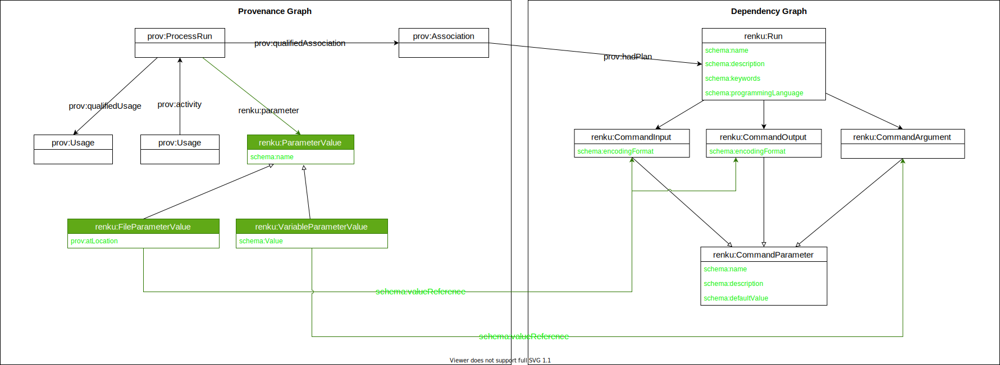

- Start Date: 2021-03-31
- Status: Proposed

# New Renku Workflow commands

## Summary

Propose new `renku workflow` command and metadata to go along with it to
enable advanced workflow use-cases.

## Motivation

So far, Renku has been mostly restricted to provenance tracking of executions, which is supported well by `renku run` (and `renku rerun`/`renku update`). We have dabbled in workflow execution/workflow management a bit, with rerun/update allowing re-execution of workflows in a very limited fashion.

This has opened up many requests for more features in this direction, like changing parameters for re-execution, importing/exporting workflows between projects, having recurrent workflows with changing output paths (e.g. daily data fetch tasks), running workflows in parallel, re-executing workflows on remote HPC clusters, to just name a few.

Renku's approach to dealing with workflows differs from regular workflow systems in that we take a more simplistic view of workflows, but we allows users to implement workflows by trying to work as normal and recording their steps as they go, as opposed to a declarative workflow language where users have to write workflow files which they can then execute. We also differ from most workflow management software in that provenance/reproducibility is at the core of our approach and not just something tacked after the fact. Additionally we (could) support provenance and workflows spanning the larger Renkulab ecosystem in the form of multi-project workflows and multi-project provenance, which traditional workflow systems don't support (they're rarely tied to a platform and any glue has to be added manually by a user).

I think we should add more workflow language level features following our approach, rather than producing yet another workflow language and that these differences to regular workflow languages do set us apart and bring something valuable to the table that isn't covered by another tool already.

However, we should keep things as simple as possible. This to me means that:

- at no point should a user ever have to manually touch one of our workflow files
- we do not support complicated branching/conditional logic, nor do we support any recursive functionality
- we don't want to end up with monstrous commands that take dozens of arguments for different scenarios, rather we'd want a few, simple commands that together enable what we want to support
- command line execution remains the basic unit of work, we don't want to drop down to the script level, i.e. one workflow step equals one command line execution of an executable or script
- all the advanced functionality is based on composing this basic unit of execution in clever ways

## Design Detail

### Proposed New Commands

#### renku workflow edit

A command to edit the metadata of an existing workflow, such as name and description like `renku workflow edit <name or uuid> --name <new name> -- description <new description> `. This should also allow naming the last executed workflow (in case a user forgot).

In addition, it should allow naming inputs/output/parameters and changing default values.

This would only edit the dependency graph side, the provenance side should not be editable (Or only support limited editing in the form of pruning the provenance graph).

##### Detailed Parameter Description

```
renku workflow edit [<options>]  <name or uuid>

<name or uuid>              The name of a workflow or its id

--name                      New name of the workflow

--description               New description of the workflow

--set <parameter>=<value>   Set default <value> for a <parameter>/add new parameter

--map <parameter>=<parameter or expression> Maps the value of a parameter to the value of another
                                            parameter or an expression. Leaving the right hand
                                            side empty removes the mapping

--rename-param <parameter>="name"   Changes the name of a parameter

--describe-param <parameter>="description"  Adds a description to a parameter
```

#### renku workflow group

Allows grouping multiple steps into a virtual workflow. Syntax would be `renku workflow group mygroup step1...stepN`, `renku workflow group --from inputfile mygroup outputfile`.

We have to ensure that all commands properly differentiate between a workflow steps and grouped workflows in naming things.

Parameter mapping can be done like `renku workflow group  --map learning_rate=step1.lr,step3.learning_rate --map log_file=mystep.log_file --map log_file=step2.log_file,step3.log_file --map step1.resultfile=step3.input2 -- mygroupedwf step1 step2 step3`

Additionally, `--map-all-inputs`, `--map-all-outputs` and `--auto-map-steps` flags would make sense, to expose all child inputs, outputs on the group, and to map inputs/outputs between steps automatically (creating a DAG).

To differentiate this from a `renku:Run`, it has node type `renku:CompositePlan` inheriting from `renku:Run`

Since grouped runs also have a name, they can be used instead of a single step in workflow commands. As such, groups can be nested arbitrarily.

If a parameter is not specified when doing a `renku workflow execute`, the value that was originally used when running that step is used. In a case like `--map-input learning_rate=step1.lr,step3.learning_rate` this would mean if `learning_rate` is not set for the group when executing, the original values are used for step1 and step3, i.e. they could differ. More specific paths override more generic paths, so `--set learning_rate=0.3 --set step1.lr=0.1` would mean everything mapped to `learning_rate` gets the value of 0.3 except for `step1.lr`, which gets set to 0.1 . The order of the `--set` doesn't matter.

##### Detailed Parameter Description

```
renku workflow group [<options>] <name> [steps...]      Create a new grouped workflow containing
                                                        <steps>
renku workflow group [<options>] <name> [paths...]      Create a new workflow creating <paths>

[steps...]                  A list of step names or UUIDs to be included in the CompositePlan

[paths...]                  A list of output paths that should be generated by the CompositePlan

--description               Description of the CompositePlan

-s|--set <parameter>=<value>   Set default <value> for a <parameter>/add new parameter

-m|--map <parameter>=<parameter or expression> Maps the value of a parameter to the value of another parameter or an expression

-d|--describe-param <parameter>="description"  Adds a description to a parameter

--map-inputs                Exposes all child inputs as inputs on the CompositePlan

--map-outputs               Exposes all child outputs as outputs on the CompositePlan

--map-params                Exposes all child parameters as parameters on the CompositePlan

--map-all                   Combination of --map-inputs, --map-outputs, --map-params

-l|--link <parameter>=<parameters> Explicit link between two child steps, to enforce an order

--link-all                  automatically link all steps based on default values

-f|--from                      File/Folder to start the DAG from. Only valid when specifying
                            <paths>
```

#### renku workflow execute

This command allows execution of a workflow template using a specified runner/provider, which could be a remote provider, e.g. for running on an HPC cluster. See also From https://github.com/SwissDataScienceCenter/renku/issues/1929

Syntax examples:
```
$ renku workflow execute --provider <provider> --config <config file> <workflow name> --values <file>
$ renku workflow execute --provider <provider> --config <config file> <workflow name> --set learning_rate=0.9 --set step3.learning_rate=0.1 --set step3.result_file=/tmp/myresult.txt
```

Provider can be something like `cwl` or `snakemake` or `argo`. Config can be something like `my-cluster.json`.

This command should support adding new providers via plugins.

Provider config can also be stored in renku.ini (similar to kube-context for k8s) or be a separate file. It contains configuration necessary for a provider (e.g. cluster ip for remote execution). Input/output mapping should map filepaths/globs or parameters to inputs/outputs of steps (see next section).

##### Detailed Parameter Description

```
renku workflow execute [<options>] <name or uuid>

<name or uuid>              The name of a workflow or its id

-p|--provider                  The workflow engine to use. Defaults to local CWLRunner. Could be
                            `cwl`, `snakemake`, `toil`, `argo` etc.

-c|--config                    YAML file containing config for the provider

-s|--set <parameter>=<value>   Set <value> for a <parameter> to be used in execution

--values <file>             YAML file containing parameter mappings to be used (See
                            `Input/Output/Argument Mappings`)

```

#### renku workflow loop

Has similar semantics to `renku workflow execute`, but allows doing multiple executions in a single go with variable inputs/outputs/parameters.

Syntax example:

```
renku workflow loop <workflow name> --mapping <mapping>
```

Where mapping is a list of mappings for input parameters/files that gets iterated over. This can contain values that are the same for all executions and then a list of parameters that vary.

Otherwise supports the same flags as `renku workflow execute`

##### Detailed Parameter Description

```
renku workflow loop [<options>] <name or uuid>

<name or uuid>              The name of a workflow or its id

-p|--provider                  The workflow engine to use. Defaults to local CWLRunner. Could be
                            `cwl`, `snakemake`, `toil`, `argo` etc.

-c|--config                    YAML file containing config for the provider

-s|--set <parameter>=[<value> | <value>,<values...>]   Set <value> or value range for a <parameter>
                                                    to be used in execution

--values <file>             YAML file containing parameter mappings to be used (See
                            `Input/Output/Argument Mappings`)

```

#### renku workflow show

`renku workflow show <name or id>` shows a description of a recorded workflow, showing the name, description, input, output and parameter names and default values as well as if there are any steps in case of a grouped workflow, plus the step mapping to the steps inside the group.

##### Detailed Parameter Description

```
renku workflow show [<options>] <name or uuid>

<name or uuid>              The name of a workflow or its id

--include-steps     Whether or not to show details for included steps. Default is to only show
                    the names of steps one level down in a CompositePlan
```

#### renku workflow visualize

It should be possible to visualize workflows/workflow groups as a DAG to see what is happening, and to visualize individual steps in a way that shows the input and outputs and other details of the individual step.

Syntax would be `renku workflow visualize <name or id>`

The output could be something like https://stackoverflow.com/questions/5408675/ascii-visualisation-of-a-graph-of-nodes-in-python/62073648#62073648

We'd also need a command to get neighbors/parents of a step.

#### renku workflow history

The `git log` of workflows. Shows executions through time for a workflow, and (with the respective flags set) what their inputs/outputs were.

##### Detailed Parameter Description

```
renku workflow history [<options>] <name or uuid>

<name or uuid>              The name of a workflow or its id

--inputs                Show input values used in each execution

--outputs               Show output values used in each execution

--parameters            Show parameter values used in each execution

-A|--all                   Combination of --inputs, --outputs and --parameters
```


#### renku workflow remove

Removes a workflow template. The template is soft-deleted (as it's still needed for provenance) and its name is freed up for reuse in a different template.
Removal is tracked by setting `prov:invalidatedAtTime` on `renku:Run` and `renku:CompositePlan`.

##### Detailed Parameter Description

```
renku workflow remove <name or uuid>

<name or uuid>              The name of a workflow or its id

-f|--force                 Force remove (don't prompt user to confirm)
```

#### renku workflow export

Exports a Renku workflow to a file of a supported workflow language (e.g. CWL).

Should have plugin support for adding new providers.

##### Detailed Parameter Description

```
renku workflow export [<options>] <name or uuid>

<name or uuid>              The name of a workflow or its id

--format                    Workflow language to export (cwl, snakemake, etc.)

-o|--output <path>          Save to <path> instead of printing to terminal
```
### Changes to Existing Commands

#### renku run

`renku run` remains the basic unit of execution of the workflows. It is left mostly as is, with the addition of `--name` and `--description` parameter and some additional functionality outlaid further down in regards to explicit parameters. If no name is supplied, we should try and auto-generate a sensible one.

One feature that we might consider is allowing to "edit" a workflow template by adding a `--replace` flag to `renku run`, that allows replacing an earlier workflow template with a modified version. The modified version would still be part of any workflow groups in the same way as its predecessor. We would have to flag workflows that become invalid after such a change and prompt the user to update them accordingly. In addition, the original template has to be kept around (in a soft-delete state) to keep the provenance side of things working.

##### Detailed Parameter Description

```
renku run [<options>] -- command args...

--name "name"                    Name of the workflow

--description "description"      Description of the workflow

-i|--input <param>=<path>        Associate name with a path/explicit input

-o|--output <param>=<path>       Associate name with a path/explicit output

-m|--map <param>="<value or expression>"    Set an output parameter

--replace                        Replace a workflow with the same name

```

#### renku rerun

Keeps existing behavior, though `--edit-inputs` should be changed to match the new input mapping style. Internally will have to be changed to work with the changed metadata. `rerun` will be focused on working with workflow provenance, not templates, i.e. it's not "execute this workflow" but "execute this workflow as it was run before". Under the hood, it should create a `renku:CompositePlan` template linked to the provenance information if more than one step is executed.

The big question is if `--edit-inputs` should be removed entirely in favor of `renku workflow execute`

#### renku update

Keeps existing behavior. Needs to be changed to work with new proposed metadata. Under the hood, it should create a `renku:CompositePlan` template linked to the provenance information if more than one step is executed.

#### renku status

Keeps existing behavior. Status checks are based on Provenance graph information, not on template default values.

### Input/Output/Argument Mappings

Various new commands allow mapping values to parameters or parameters to other parameters. These mappings can be specified on the command line directly or by passing a file that specifies them.

In case of passing a file, the structure of the yaml file looks like:

```
learning_rate: 0.9
dataset_input: dataset.csv
chart_output: mychart.png
myworkflow:
    lr: 0.8
    lookuptable: lookup.xml
    myotherworkflow:
        language: en
```

At the top level, it specifies the parameter values of the workflow (run or grouped run) to be executed. It can also contain values for steps contained in a grouped run, by specifying the name of the step and setting parameters for that step. In case of the grouped run mapping its values to child steps, setting values for child steps directly overwrites those values for the step and all its (potential) children.

For `renku workflow loop` the values file looks like:

```
learning_rate: 0.9
dataset_input: dataset.csv
chart_output: mychart.{loop_index}.png
looped_parameters:
    - alpha: 0.1
      beta: 0.7
    - alpha: 0.2
      beta: 0.6
    - alpha: 0.5
      beta: 0.2
myworkflow:
    lr: 0.8
    lookuptable: lookup.xml
    myotherworkflow:
        language: en
```

Where the workflow is run for each entry in `looped_parameters` and the templated variable `{loop}` is substituted for the loop index (1, 2, 3, ...).

On the commandline, values can be specified with `--set learning_rate=0.9 --set myworkflow.lr=0.8`.

#### Templated Values

Parameter values can contain one of several templated values or glob patterns:

- `{loop_index}`: Loop index in the case of a `renku workflow loop` call.
- `{%m-%d-%Y_%H-%M-%S}`: Current date/time (Following python date formatting).
- `a*b?`: Glob/`fnmatch` patterns for paths.

In addition, values can be set based on the content of output files, if those files' contents are json formatted:

- `{$stdout.data.entries[-1].name}` would use JSONPath against stdout, if stdout looks like `{'data': {'entries': [..., {'name': 'John'}]}}` where `$stdout` and `$stderr` are reserved names pointing to the respective standard streams, or by pointing to a file output directly like `{my_output_file.data.entries[0].name}`

JSONPath matching can only be used to set output parameter values.

#### Temporary Files

Sometimes we don't want to commit a file to git or track it in the provenance graph. For these cases, it can be marked as temporary. It will still be tracked in the dependency graph.

In these cases, a path can be wrapped in `tmp()` on the original `renku run`, either as an explicit input or output, like `renku run -i myoutput=tmp(output.txt) -- python ...`

### Metadata Changes

The green parts of the following graphs show additions to the metadata

#### Changes to existing metadata

- Remove `renku:produces` and `renku:consumes` in favor of `schema:defaultValue`
- Remove `prov:hadRole` from Usages and Generations
- `CommandParameter`, `CommandInput` and `CommandOutput`'s ids should extend the `Plan`s id.
- Add `position` values to inputs/outputs mapped to stdin/out/err (stdin = max-position + 1, stdout = max-position + 2, stderr = max-position + 3)
- Remove `isPartOf` from `Entity`. In general, move away from every object pointing to the project and instead only have top-level nodes (Dataset, Plan, Activity) link to the Project.

#### prov:ProcessRun and renku:Run Additions



On the provenance side, we add `renku:ParameterValue` for paths and simple values, respectively. `renku:ParameterValue`s are duplicated for each execution.

On the dependency graph side, we rename `renku:CommandParameter` to `renku:CommandParameterBase` and `renku:CommandArgument` to `renku:CommandParameter`. We also remove the use of `prov:Entity` and instead add `schema:defaultValue` to `renku:CommandParameterBase`, which will be set to the values used on first execution. The `renku:ParameterValue` entries mentioned above map to the `renku:CommandParameterBase` classes as a way to show which value of an execution maps to which value of the template. In addition, `renku:Run` and the `renku:CommandParameterBase` types get `schema:name` and `schema:description` fields to allow annotating them with meaningful information.

*The `renku:CommandInput` and `renku:CommandOutput` types also get extended with `schema:encodingFormat` to store MIME-type information in the case of files (Not used for folders). * [Does this make sense? Should this rather be on the provenance side?]

#### renku:CompositePlan


A new type `renku:CompositePlan` is introduced to keep track of workflows composed of steps. Instead of `renku:CommandParameterBase` entries, this has `renku:ParameterMapping` entries that expose parameter of child steps on the grouped run. A `renku:ParameterMapping` can point to multiple mapped parameters, but can only be pointed to by one `renku:CompositePlan`. Also allows defining links between child steps' parameter to enforce an executon order, using the `renku:ParameterLink` node pointed to by `renku:workflowLinks`. A `ParameterLink` has a `renku:linkSource` originating in a `renku:CommandOutput` and points to one or more `renku:CommandInput`
as a `renku:linkSink`.

#### looped runs


For looped workflows, no addition is needed on the dependency side of things, as the workflow is merely called repeatedly. On the provenance side, a new node `renku:LoopedActivity` is introduced that groups `prov:Activity` entries by the loop they were used in.

### Example Use-Cases

#### Remote Execution

Execute a workflow on a large dataset on an HPC cluster

```Shell
$ renku run --name SlowDatasetAnalysis --description "very slow analysis on a huge dataset" -- python analysis.py --dataset small_dataset.csv --batch-size 32 --output results.csv
Workflow recorded and executed in 0.2s.
Id: b5a9d99a-0870-48ab-8ede-d22bde502684
Name: SlowDatasetAnalysis
The following outputs were produced:
    output (file): results.csv
$ renku workflow show SlowDatasetAnalysis
Id: b5a9d99a-0870-48ab-8ede-d22bde502684
Name: SlowDatasetAnalysis
Description: very slow analysis on a huge dataset
Command: python
Inputs:
    input_file1(file): analysis.py
    dataset (file): small_dataset.csv
    batch-size (number): 32
Outputs:
    output (file): results.csv

$ renku workflow execute SlowDatasetAnalysis --provider slurm --config slurm-cluster.config --set dataset=large_dataset.csv --set output=final_results.csv --set batch-size=128
Connecting to cluster...
Preparing environment....
Executing workflow...
Gathering results...
Finished in 51m32s
The following outputs were produced:
    output (file): final_results.csv

```

#### Grid Search

Do a hyperparameter gridsearch

```Shell
$ renku run --name train_model --description "train a model" --output output_file=tmp(out.txt) --map accuracy="{$stdout.epochs[-1:].test.accuracy}" --map f1="$stdout.epochs[-1:].test.f1" -- python train.py train.csv test.csv --batch-size 32 --lr 0.9 --epochs 5 > out.txt
Workflow recorded and executed in 2.3s.
Id: b5a9d99a-0870-48ab-8ede-d22bde502684
Name: train_model
The following outputs were produced:
    stdout (file): tmp(stdout)
    accuracy (number): 66.7
    f1 (number): 23.5
OK
$ renku workflow show train_model
Id: b5a9d99a-0870-48ab-8ede-d22bde502684
Name: train_model
Description: train a model
Command: python
Inputs:
    input_file1(file): train.py
    input_file2 (file): train.csv
    input_file3 (file): test.csv
    batch-size (number): 32
    lr (number): 0.9
    epochs (number): 5
Outputs:
    output_file (file): tmp(out.txt)
    accuracy (number): 66.7
    f1 (number): 23.5
$ echo "
static:
  epochs: 200
  output_file: result.{loop_index}.json
variable:
- lr:0.1
  batch-size: 32
- lr:0.2
  batch-size: 64
- lr:0.5
  batch-size: 128
- lr:1.0
  batch-size: 1024
" > mapping.yaml
$ renku workflow loop --provider cwl --mapping mapping.yaml train_model
Preparing environment....
Executing workflows
Run 1...
Run 2...
Run 3...
Run 4...
Finished in 21m11s
Results:
    Run 1:
        stdout (file): result.1.json
        accuracy (number): 34.4
        f1 (number): 9.4
    Run 2:
        stdout (file): result.2.json
        accuracy (number): 96.2
        f1 (number): 77.0
    Run 3:
        stdout (file): result.3.json
        accuracy (number): 10.1
        f1 (number): 2.3
    Run 4:
        stdout (file): result.4.json
        accuracy (number): 91.2
        f1 (number): 81.3
```

#### Train-Eval-Test

Regular ml workflow with train-, eval- and testsets

```Shell
$ renku run --name train_model --description "train a model" -- python run_model.py --mode train train.csv
Workflow recorded and executed in 2.3s.
Id: b5a9d99a-0870-48ab-8ede-d22bde502684
Name: train_model
The following outputs were produced:
    output_file1 (file): results.txt
$ renku workflow show train_model
Id: b5a9d99a-0870-48ab-8ede-d22bde502684
Name: train_model
Description: train a model
Command: python
Inputs:
    input_file1(file): run_model.py
    input_file2 (file): train.csv
    mode (string): train
    epochs (number): 5
Outputs:
    output_file1 (file): results.txt
$ renku workflow edit train_model --rename-param dataset=input_file2 --rename-param result=output_file1
$ renku workflow execute train_model --set mode=test --set dataset=test.csv --set result=test.txt
[...]
$ renku workflow execute train_model --set mode=test --set dataset=eval.csv --set result=eval.txt
[...]
```
It's not clear if remapping an output like this if it's not part of the command is something we can/should do. It would mean that the output is still under `results.txt` and we have to move it to e.g. `test.txt`, since `results.txt` would be hardcoded in the script in this case.

#### Recurring data import

```Shell
$ renku run --name download-data --description "Downloads the daily data csv" --output datafile="data.{%Y-%m-%d}.csv" -- bash download.sh
Workflow recorded and executed in 2.3s.
Id: b5a9d99a-0870-48ab-8ede-d22bde502684
Name: download-data
The following outputs were produced:
    datafile (file): data.*.csv
        Matching:
            data.2021-02-23.csv
[... one day later...]
$ renku workflow execute download-data
Preparing environment....
Executing workflow...
Gathering results...
Finished in 1.4s
The following outputs were produced:
    datafile (file): data.*.csv
        Matching:
            data.2021-02-23.csv
            data.2021-02-24.csv
```
#### Workflow execution with extensive parameter search
See detailed user story to `renku workflow loop` [here](https://github.com/SwissDataScienceCenter/renku-python/edit/rfc-001-workflow-ux/design/001-new-workflow-commands/user-story-workflow-execution-with-extensive-parameter-space.md)

## Drawbacks

- Makes workflows more complicated and more difficult to reason about.
- Makes graph queries more complex.
- Duplicates functionality that's already available in workflow languages

## Rationale and Alternatives

Since we want to use different workflow backends, it makes sense to have a common denominator language that can be mapped to those languages. And it makes sense to have this live in the Knowledge Graph, so it can easily be accessed and processed in our application. Having CLI commands to achieve this should help usability and support users that might not be familiar with workflow languages.

An alternative would be to pick an existing workflow language and just embed that in our graph. Users would then have to write workflows in that language and Renku would just have support for tracking executions done in that language. We would still need to represent this in the KG or have e.g. the UI parse those workflow files to display them to users. We already tried this approach to some extent with how we used CWL in the past, but having to parse the files and not having the metadata stored in an easily accessible format was cumbersome.

Not doing this and leaving `renku run/rerun/update` as is would severely limit use-cases that have repeatedly been brought up users and also limits Renku's usefulness for tracking provenance, possibly discouraging users from using the feature altogether.

## Unresolved questions

This RFC should specify commands and metadata needed for workflow support in Renku.

Minor changes to the metadata and commands can come up during the implementation phase, but the RFC should be complete enough that this isn't necessary.

This RFC does not deal with asynchronous execution nor does it deal with importing workflows from other projects. Both of these should be done in follow-up RFCs.


## Implementation Plan

- Enhance `renku run` to create new metadata (except grouped/looped runs) with `renku rerun` and `renku update` working as normal
- Add basic new workflow commands
  - Create `renku workflow edit`
  - Create `renku workflow export`
  - Create `renku workflow execute`
- Add display commands
  - `renku workflow show`
  - `renku workflow visualize`
  - `renku workflow history`
- Add Grouped run functionality
- Add Looped run functionality
- Add Glob support
- Add template support to values
- Add JSONPath support
- Add more providers
