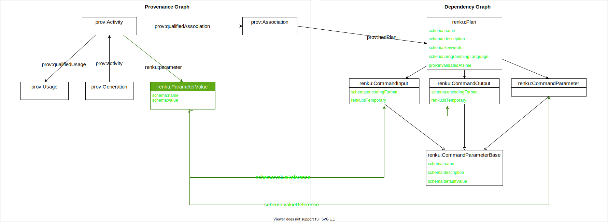

- Start Date: 2021-03-31
- Status: Proposed

# New Renku Workflow commands

## Summary

Propose new `renku workflow` command and metadata to go along with it to
enable advanced workflow use-cases.

## Motivation

So far, renku has been mostly restricted to provenance tracking of executions, which is supported well by `renku run` (and `renku rerun`/`renku update`). We have dabbled in workflow execution/workflow management a bit, with rerun/update allowing re-execution of workflows in a very limited fashion.

This has opened up many requests for more features in this direction, like changing parameters for re-execution, importing/exporting workflows between projects, having recurrent workflows with changing output paths (e.g. daily data fetch tasks), running workflows in parallel, re-executing workflows on remote HPC clusters, to just name a few.

Renku's approach to dealing with workflows differs from regular workflow systems in that we take a more simplistic view of workflows, but we allows users to implement workflows by trying to work as normal and recording their steps as they go, as opposed to a declarative workflow language where users have to write workflow files which they can then execute. We also differ from most workflow management software in that provenance/reproducibility is at the core of our approach and not just something tacked after the fact. Additionally we (could) support provenance and workflows spanning the larger renkulab ecosystem in the form of multi-project workflows and multi-project provenance, which traditional workflow systems don't support (they're rarely tied to a platform and any glue has to be added manually by a user).

I think we should add more workflow language level features following our approach, rather than producing yet another workflow language and that these differences to regular workflow languages do set us apart and bring something valuable to the table that isn't covered by another tool already.

However, we should keep things as simple as possible. This to me means that:

- at no point should a user ever have to manually touch one of our workflow files
- we do not support complicated branching/conditional logic, nor do we support any recursive functionality
- we don't want to end up with monstrous commands that take dozens of arguments for different scenarios, rather we'd want a few, simple commands that together enable what we want to support
- command line execution remains the basic unit of work, we don't want to drop down to the script level, i.e. one workflow step equals one command line execution of an executable or script
- all the advanced functionality is based on composing this basic unit of execution in clever ways

## Design Detail

### Proposed New Commands

#### renku workflow edit

A command to edit the metadata of an existing workflow, such as name and description like `renku workflow edit <uuid or name> --name <new name> -- description <new description> `. This should also allow naming the last executed workflow (in case a user forgot).

In addition, it should allow naming inputs/output/parameters and changing default values.

This would only edit the dependency graph side, the provenance side should not be editable (Or only support limited editing in the form of pruning the provenance graph).

#### renku workflow group

Allows grouping multiple steps into a virtual workflow. Syntax would be `renku workflow group mygroup step1...stepN`, `renku workflow group --from inputfile --to outputfile mygroup`, `renku workflow group --from-step <starting-step> --to-step <end-step> mygroup`.

We have to ensure that all commands properly differentiate between a workflow steps and grouped workflows in naming things.

Parameter mapping can be done like `renku workflow group  --map-input learning_rate=step1.lr,step3.learning_rate --map-output log_file=mystep.log_file,step2.log_file,step3.log_file --map-step step1.resultfile=step3.input2 -- mygroupedwf step1 step2 step3`

Additionally, `--map-all-inputs`, `--map-all-outputs` and `--auto-map-steps` flags would make sense, to expose all child inputs, outputs on the group, and to map inputs/outputs between steps automatically (creating a DAG).

To differentiate this from a `renku:Run`, it'could be a `renku:GroupedRun` node inheriting from `renku:Run`

Since grouped runs also have a name, they can be used instead of a single step in workflow commands. As such, groups can be nested arbitrarily.

If a parameter is not specified when doing a `renku workflow execute`, the value that was originally used when running that step is used. In a case like `--map-input learning_rate=step1.lr,step3.learning_rate` this would mean if `learning_rate` is not set for the group when executing, the original values are used for step1 and step3, i.e. they could differ. More specific paths override more generic paths, so `--set learning_rate=0.3 --set step1.lr=0.1` would mean everything mapped to `learning_rate` gets the value of 0.3 except for `step1.lr`, which gets set to 0.1 . The order of the `--set` doesn't matter.

#### renku workflow execute

This command allows execution of a workflow template using a specified runner/provider, which could be a remote provider, e.g. for running on an HPC cluster. See also From https://github.com/SwissDataScienceCenter/renku/issues/1929

Syntax examples:
```
$ renku workflow execute --provider <provider> --config <config file> <workflow name> --mapping <mapping>
$ renku workflow execute --provider <provider> --config <config file> <workflow name> --set learning_rate=0.9 --set step3.learning_rate=0.1 --set step3.result_file=/tmp/myresult.txt
```

Provider can be something like `cwl` or `snakemake` or `argo`. Config can be something like `my-cluster.json`.

This command should support adding new providers via plugins.

Provider config can also be stored in renku.ini (similar to kube-context for k8s) or be a separate file. It contains configuration necessary for a provider (e.g. cluster ip for remote execution). input/output mapping should map filepaths/globs or parameters to inputs/outputs of steps (see next section).

#### renku workflow loop

Has similar semantics to `renku workflow execute`, but allows doing multiple executions in a single go with variable inputs/outputs/parameters.

Syntax example:

```
renku workflow loop <workflow name> --mapping <mapping>
```

Where mapping is a list of mappings for input parameters/files that gets iterated over. This can contain values that are the same for all executions and then a list of parameters that vary.

Otherwise supports the same flags as `renku workflow execute`

#### renku workflow show

`renku workflow show <name or id>` shows a description of a recorded workflow, showing the name, description, input, output and parameter names and default values as well as if there are any steps in case of a grouped workflow, plus the step mapping to the steps inside the group.

#### renku workflow visualize

It should be possible to visualize workflows/workflow groups as a DAG to see what is happening, and to visualize individual steps in a way that shows the input and outputs and other details of the individual step.

Syntax would be `renku workflow visualize <name or id>`

The output could be something like https://stackoverflow.com/questions/5408675/ascii-visualisation-of-a-graph-of-nodes-in-python/62073648#62073648

We'd also need a command to get neighbors/parents of a step.

#### renku workflow history

The `git log` of workflows. Shows executions through time for a workflow, and (with the respective flags set) what their inputs/outputs were.

Syntax example:

```
$ renku workflow history <name or id> --inputs --outputs
```


#### renku workflow remove

Removes a workflow template. The template is soft-deleted (as it's still needed for provenance) and its name is freed up for reuse in a different template.

#### renku workflow export

Exports a Renku workflow to a file of a supported workflow language (e.g. CWL).

Syntax example:
```
$ renku workflow export --format cwl <name or id> -o myworkflow.cwl
```

Should have plugin support for adding new providers.

### Changes to Existing Commands

#### renku run

`renku run` remains the basic unit of execution of the workflows. It is left mostly as is, with the addition of `--name` and `--description` parameter and some additional functionality outlaid further down in regards to explicit parameters. If no name is supplied, we should try and auto-generate a sensible one.

One feature that we might consider is allowing to "edit" a workflow template by adding a `--replace` flag to renku run, that allows replacing an earlier workflow template with a modified version. The modified version would still be part of any workflow groups in the same way as its predecessor. We would have to flag workflows that become invalid after such a change and prompt the user to update them accordingly. In addition, the original template has to be kept around (in a soft-delete state) to keep the provenance side of things working.

#### renku rerun

Keeps existing behavior, though `--edit-inputs` should be changed to match the new input mapping style. Internally will have to be changed to work with the changed metadata. `rerun` will be focused on working with workflow provenance, not templates, i.e. it's not "execute this workflow" but "execute this workflow as it was run before". Under the hood, it should create a `renku:GroupedRun` template linked to the provenance information if more than one step is executed.

The big question is if `--edit-inputs` should be removed entirely in favor of `renku workflow execute`

#### renku update

Keeps existing behavior. Needs to be changed to work with new proposed metadata. Under the hood, it should create a `renku:GroupedRun` template linked to the provenance information if more than one step is executed.

#### renku status

Keeps existing behavior. Status checks are based on Provenance graph information, not on template default values.

### Metadata Changes

#### prov:ProcessRun and renku:Run Additions



### Example Use-Cases

## Drawbacks

> Why should we *not* do this? Please consider the impact on users,
on the integration of this change with other existing and planned features etc.

> There are tradeoffs to choosing any path, please attempt to identify them here.

## Rationale and Alternatives

> Why is this design the best in the space of possible designs?

> What other designs have been considered and what is the rationale for not choosing them?

> What is the impact of not doing this?

## Unresolved questions

> What parts of the design do you expect to resolve through the RFC process before this gets merged?

> What parts of the design do you expect to resolve through the implementation of this feature before stabilisation?

> What related issues do you consider out of scope for this RFC that could be addressed in the future independently of the solution that comes out of this RFC?
