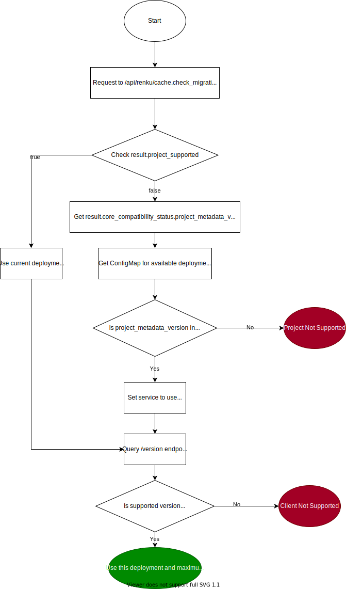

# Renku Core Service API Versioning

To maintain for backwards compatibility and not force migrations on users, we need to support multiple versions of the core-service in parallel.

This boils down to two concerns, supporting multiple metadata versions for the metadata in the repository, and supporting multiple versions
of the core service API to allow backwards compatibility of the interface.

## Multiple Metadata Versions

This section is about how to deal with changes in how renku stores its internal metadata (in `.renku/`) and breaking changes to the metadata format.

### Problem

We sometimes have to change how we store metadata internally in renku. This can be big changes like switching from the *.yml based approach of storing metadata
to the database based approach that is being introduced in 1.0.0, or minor changes like adding new fields to entities.

Due to such changes, older projects without these changes aren't supported with the current version and require a migration to be supported.
Usually it is not possible to support multiple metadata versions in the same version of renku, as this would bloat the code, make it hard to maintain and
has a high potential of introducing additional bugs.

Because of this, it makes more sense to deploy new and old versions of the core service side by side, and let the UI pick which one to use for each project.

### Detecting if a project is supported

`/cache.migrations_check` only actually needs `.renku/metadata/root` and `.renku/metadata/project` checked out to work, plus optionally `Dockerfile` to return dockerfile info.

We need to clone at least `.renku/metadata/project` in a project to know the metadata version, so that files has to be accessed no matter what. Since this is the case, we might as well clone all 3 of the files mentioned above and do a full `cache.migrations_check` to figure out the metadata version, bypassing the cache. Otherwise we'd have multiple endpoints serving essentially the same information. We can selectively clone to a temp directory using the `git archive` approach mentioned on https://stackoverflow.com/a/64776113/212971 .

`cache.migrations_check` would be changed to:

- Try and download/clone `.renku/metadata/root` and `.renku/metadata/project` to a temporary directory for the project
  - If that fails, try and download/clone `.renku/metadata.yml` to the same temporary directory
  - If that fails, return
- Try and download/clone `Dockerfile` to a temporary directory for the project.
- run the migrations check code and return all the migrations check information.

This lets the Ui know if a project is supported and what metadata version (currently `9`) the project is on, as well as what metadata version the core-service supports.
If the request returns  `"result": { "project_supported": true, ...}` it can use this version of the service.
If `"result": {"project_supported": false, ...}`, it can get the `result: {"core_compatibility_status": {"project_metadata_version": "8", ...}, ...}` value, e.g. `7`,
check if there is a core-service for metadata version 7 deployed (more on that later) and if so, use that version of the core-service. If no core-service for this version
is deployed, the project is not supported and need a migration.

### Deployment

Deploying multiple core-service side-by-side in the `renku-core` chart should be relatively easy, we can create multiple [deployments](https://github.com/SwissDataScienceCenter/renku-python/blob/master/helm-chart/renku-core/templates/deployment.yaml)
with unique names for each version (only differing in the `image` field and maybe some configuration values if those are changed).

The deployment for the main/current renku core service can be named `renku-core` as it is now, and other can be called `renku-core-v8`, `renku-core-v7` etc.
This allows use of `renku-core` as the main/first entrypoint as before, and client that can't handle the multiple versions can use that as if nothing changed.

In addition, a new ConfigMap is created that contains a list of all the available versions and their deployments, like

```
apiVersion: v1
kind: ConfigMap
metadata:
  name: renku-core-versions
data:
  renku-core-versions: |-
    9: renku-core
    8: renku-core-v8
    7: renku-core-v7
```

This configmap can then be served through Nninx, allowing clients to lookup which versions of `renku-core` are deployed and where to reach them.

### Service URLs/UX

The gateway can serve the different `renku-core` instances on different urls. I suggest `https://renkulab.io/api/renku/` for the main one, and
`https://renkulab.io/api/renku-v8/`, `https://renkulab.io/api/renku-v7/` etc. for the others.


## Core service API versioning

### Problem

There are two other issues with running multiple versions of core-service in parallel, namely:
- New endpoints that don't exist
- Existing endpoints that have a modified interface

For new endpoints that don't exist, well, we won't backport them to old versions, that's too much effort. The question there is, how does the UI know what is and isn't supported? Similarly, for existing endpoints where the interface changes, we can try and deprecate things but keep them functional in case of deleted parameters, but if we add parameters, the service also raises an exception if it gets a parameter that it doesn't know.
So the UI couldn't just call old endpoints and expect everything to work.

### API Versioning

We introduce a new API versioning scheme for `renku-python` where we version our endpoints. An initial version, 1.0 is defined as the state of the service as it is right now
(1.0.0 release / 0.16.2 release). In the 1.0.0 release we also include changes from https://github.com/SwissDataScienceCenter/renku-python/pull/2122 which will be 1.1 of the API.
Major versions follow the main `renku-python` versioning scheme. If we release `renku-python` version 2.0.0 we bump the API version to 2.0, and otherwise we bump the minor version
on breaking API changes.
Versioning is done through the URL, e.g. `https://renkulab.io/api/renku/1.0/`, `https://renkulab.io/api/renku/1.1/`, `https://renkulab.io/api/renku-v7/1.0/` but with the special case
of no version being passed (e.g. `https://renkulab.io/api/renku/cache.migrations_check`) defaulting to 1.0 (or lowest supported version), for backwards compatibility.

In the `renku-python` code we achieve this by having Blueprint specifications for each version, as outlined in https://gist.github.com/berend/fb8fd98be235aec7c6d12782805d7bff .
If an endpoint has a breaking change, it results in a new (minor) version. Unchange endpoints are available in both the new and old version, so each version offers the full
range of capabilities and each client can just use the API version it supports, without being affected by new breaking changes.

The `/version` endpoint is modified to return

```
{
    "result": {
        "latest_version": "1.0.0",
        "supported_project_version": 9,
        "minimum_api_version": "1.0",
        "maximum_api_version": "1.1"
    }
}
```

where `latest_version` (the pypi packet version of `renku-python` used in the service) and `supported_project_version` (the metadata version supported on this instance of core-service) already exist.
A final version of `renku-python` 0.16.x is made (version 0.16.3) that returns `1.0` hard coded for `minimum_api_version` and `maximum_api_version` to support renku-core versions
 < 1.0.0.

## Lifecycle

A fix lifecycle should be defined both for metadata versions and API versions. This is to make clear how long each of them are supported on the platform.

Since versions might change on an irregular schedule, it makes sense to limit this by time rather than version number.

A proposal would be to support past versions for 12 months.
If e.g. metadata version 8 was introduced 12 months ago, we drop support for metadata version 7 i.e. `renku-core-v7` no longer gets deployed and is not supported anymore.

For API versions (like 1.1), the current version of `renku-python` has to at least support as a `minimum_api_version` the `maximum_api_version` of the oldest still supported
`renku-core` deployment, so that there is at leats one API version that is available on all `renku-core` deployments.

Versions that are less than 6 months old get hotfixes/backports of fixes, within reason, whereas versions older than that are provided as-is.

## Special Case Migrations

Requests for `cache.migrate` MUST be sent to the newest deployed version of `renku-core`. While the migration is running, no write requests are allowed to be sent to any version of the service.

## Special Case Dataset Import

Dataset import from other renku projects might not work if the deployment of `renku-core` used for the import is older than what was used in the project that is imported from.
There is no solution for this and dataset import in these cases is only possible if a user migrates to a version at least the same as the source project.
Clients get an error in this case and need to deal with it appropriately.

## Summary

A client wishing to make a request to a `renku-core` service for a project would follow the following flowchart:



A client can store the result of the above for repeat calls.