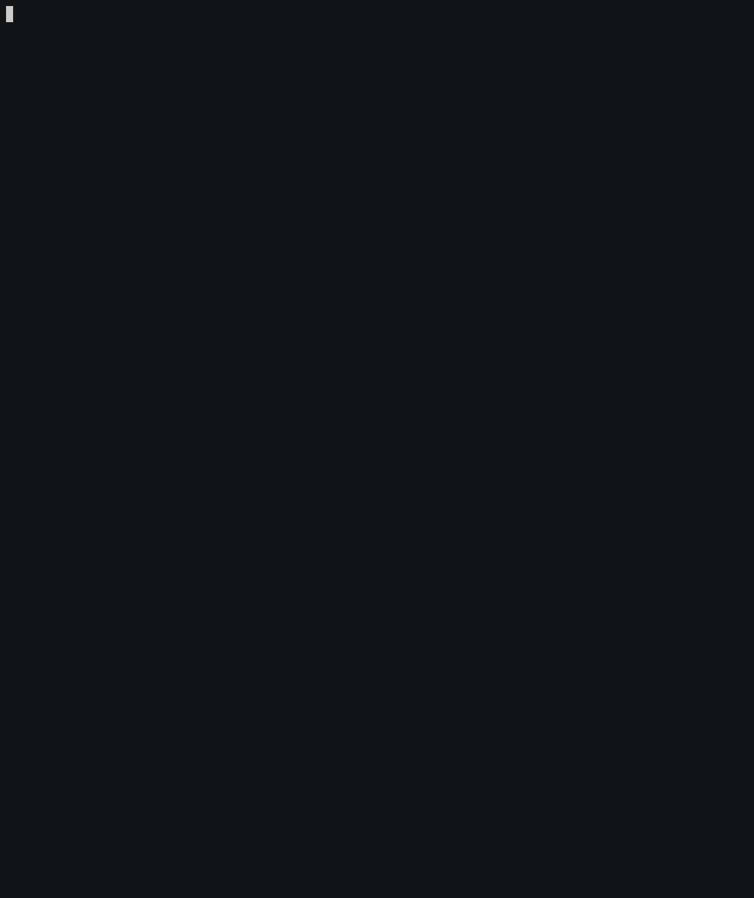

# Renku Python 1.0.0 Release Notes

After a period of relative silence, we are happy to announce the release of the Renku Python library version 1.0.0 :tada:

This release contains a ton of changes, with a complete overhaul of workflow commands and cleaning up existing commands. We also introduced plugin support that allows Renku to support arbitrary workflow backends for execution.

We also reworked our metadata storage, leading to a big improvement in both performance and storage requirements when working with the commandline interface in projects.

## New Workflows

With 1.0.0, we completely overhauled how workflows work, improving on existing functionality and introducing new commands to create a full-blown workflow system, with all the features needed to support reusable, composable and modifiable workflows.

### Runs and Plans

Previously, we would track executions of commands done with `renku run` and allow you to `renku rerun` or `renku update` recorded pipelines with new values to enable reproducibility and support rudimentary workflow functionality. While this did record the commands that were run to create a file, it gave users very little tools to reuse those workflows or to compose them in novel ways.

To improve on this, we now have two separate concepts, `Runs` and `Plans`.

A `Run` is a record of a past workflow execution, keeping track of what workflow was executed when with which inputs and results. This ensures reproducibility and allows keeping track of what happened in a project.

A `Plan` is a template or recipe of a workflow, storing the command of a workflow, what parameters it has and how those parameters can be set. A `Plan` can be executed repeatedly, with differing parameters and with variable execution backends. `Plans` are at the core of the new Renku workflows and form a workflow language in their own right, albeit not one written by hand but recorded by example.

When you do a `renku run` command, Renku will create both a `Plan` for the command you ran as well as a `Run` to remember this execution.

### Working with New Workflows

There is a lot of new workflow functionality, such as:

- Running workflows independent of past executions
- Composing workflows into complex pipelines
- Executing workflows with different execution backends
- Executing the same workflow multiple times for ranges of values (think grid search)
- Visualizing workflow executions and navigating through the resulting graph
- Exporting workflows to various workflow format
- Extended plugin support



As before, you can record workflows using `renku run`, with the change that you can now also specify a name for the generated `Plan`, like `renku run --name my-plan myscript.py dataset.csv summary.csv`.

You can use `renku rerun` and `renku update` as before, but their responsibilities are more clearly defined now.  `renku rerun` is intended for reproducing a result by re-executing a past chain of `Runs` again in the same way and `renku update` is intended for updating outputs of past `Runs` based on changed/updated input data.


To execute a recorded `Plan` independently of past executions, you can use `renku workflow execute my-plan`, which would essentially re-execute the original `renku run`. To make things more interesting, you can change the values used by the plan, using `--set parameter=value`, e.g. `renku workflow execute --set input-1=other-dataset.csv my-plan`, which would execute `my-plan` but with `other-dataset.csv` as the input file. Use `renku workflow show my-plan` to see the available parameters and `renku workflow edit my-plan` to rename parameters, add a description to the plan and other things.


You can use the `Plans` you create as building blocks for more complicated pipelines, by composing them using the `renku workflow compose` command, which lets you group  `Plans` arbitrarily, defining links between steps and mapping for values. These composite `Plans` can then be executed and worked with the same as `Plans` created by `renku-run`. This way, you can create complex workflows by example, instead of having to write workflow specifications by hand.

To see how a file was created, we have a new command `renku workflow visualize` that shows a graph of all the workflows involved in creating a file. Try out its `-i` flag for interactive mode!

You can use `renku workflow iterate` command to run your existing `Plans` with different parametrization. The iteration parameters could either be specified in a simple YAML file or with the `--map param1=[values]` command line argument. The possible values for a parameter should be given as a list. In some circumstances, one would like to mark each iteration index in a parameter's value, for such case one could use the `{iter_index}` template in the parameter's value. The template variable is going to be substituted with the iteration index (0, 1, 2, ...).

For example, in case of a `Plan` that trains a simple machine learning model, the mapping file could look like something like this:
```
learning_rate: [0.01, 0.001, 0.0001]
n_estimators: [100, 200, 300, 400]
output: model_{iter_index}
```
This would execute your plan several times with values taken from the cartesian product of values in `learning_rate` and `n_estimators`, producing the output files `model_0`, `model_1`, etc.

Once you created the parameter mapping file, simply run `renku workflow iterate --mapping values.yaml my-plan`.


You can also export your `Plans` into various formats such as CWL (Common Workflow Language) using `renku workflow export`, which allows you to run them outside of renku.

### Plugin Support
Another main feature of this release is that the execution backends and converters for `Plans` are now completely plugin based, allowing us and third parties to support running Renku workflows on your tool of choice and exporting Renku workflows to your format of choice, if a plugin has been implemented.

Implementation of execution plugins is relatively easy and they can be packaged in their own Python packages and installed alongside Renku, which will automatically pick up all plugins available on your system.

This is a big step in interoperability for Renku and makes it easier to run Renku workflows on environments like HPC clusters or the cloud.

## New Metadata Storage / Performance Improvements

We have completely reworked how we store Renku metadata inside projects. Before, metadata was stored in YAML files that contained data in a relatively inefficient storage format. In addition, the metadata was stored in individual Git commits, meaning that for some Renku commands we had to scan through the Git history to gather all the relevant information. This also meant that on updates to Renkulab with breaking changes in the Renku CLI, we had to process each commit in a project individually to regenerate our metadata, which on some larger projects could take weeks.

We now store all the metadata for a project in in a custom object database. This allows us to store all the metadata in the current commit of the project, no longer needing to walk the Git history.

We sometimes need to change our data model to support adding new features, and these changes mean that the data in projects needs to be updated to be in line with our current code base, which we do in the form of migrations (Which you can run through clicking the Migrate button on renkulab or locally with `renku migrate`). The move to this new database storage speeds up migrations for our metadata dramatically, with projects that previously took hours to migrate now being migrated in minutes to seconds, greatly reducing downtime on migration for new releases.

We can also easily add indices and other optimizations in the database to enable speedy lookups of data and improve performance overall. This is especially noticeable on large projects, where renku commands such as `renku status` that could previously take several minutes to complete now only take a few seconds.

The database is stored in a compressed format, reducing storage requirements that could be pretty sizeable on bigger projects.

## Improved Backwards Compatibility

We are also introducing a mechanism that allows projects that do not wish to migrate to a newer release of Renku immediately to still be supported in the Renkulab user interface. Where previously you had to migrate your project to be able to do things such as creating new datasets, you can now still perform these actions without migrating when there is a new release.

We still encourage users to migrate so they can benefit from new features and bug fixes, but this change allows you to do so on your own time instead of being forced to do it.

We will support project versions for up to 12 months before a migration becomes mandatory for continued support.


## Thanks
We'd like to thank the whole team for making this huge leap forward possible and for the blood, sweat and tears that went into this change. The amount of hard work, debates and problem solving necessary for these changes was a lot more than usually and it wouldn't have been possible without the great dedication of everyone involved.
